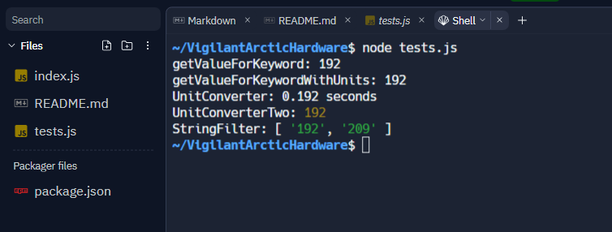

# Keyword Value Processing Toolkit

This toolkit provides a set of functions and classes for processing keyword-value pairs from formatted strings, supporting unit conversions, filtering, and more.

Created by Brian Sward
Created on 2023-08-10

## Functions and Classes

### getValueForKeyword(inputString, desiredKeyword)
Returns the value associated with a desired keyword from the input string.

### getValueForKeywordWithUnits(inputString, desiredKeyword)
Returns the value associated with a desired keyword from the input string, with optional unit conversion.

### UnitConverter Class
A class that supports unit conversions for values with units specified in the input string.

### UnitConverterTwo Class
A class that extends the concept of `UnitConverter`'s functionality to find the maximum value for a desired keyword across multiple input strings.

### StringFilter Class
A class that supports filtering values based on criteria and keywords.

## Testing / Usage Examples

To test the above functions, clone down the repo, open a terminal and in the directory which contains both tests.js and index.js type:

    node tests.js




Below are snippets of code examples and usage.

```javascript
const { getValueForKeyword, getValueForKeywordWithUnits, UnitConverter, UnitConverterTwo, StringFilter } = require('./index');

// Example usage of getValueForKeyword
const inputString = `
    EXPOSURE_DURATION = 192
    DETECTOR_TEMPERATURE = -42.55
    `;
const desiredKeyword = "EXPOSURE_DURATION";
console.log(getValueForKeyword(inputString, desiredKeyword)); // Output: 192

// Example usage of getValueForKeywordWithUnits
const inputString = `
    EXPOSURE_DURATION = 192 <MS>
    DETECTOR_TEMPERATURE = -42.55
    `;
const desiredKeyword = "EXPOSURE_DURATION";
console.log(getValueForKeywordWithUnits(inputString, desiredKeyword)); // Output: 0.192 seconds

// Example usage of UnitConverter
const unitConverter = new UnitConverter();
console.log(unitConverter.convertValue("192 <MS>")); // Output: 0.192 seconds

// Example usage of UnitConverterTwo
const unitConverterTwo = new UnitConverterTwo();
console.log(unitConverterTwo.getMaximumValueForKeyword([inputString1, inputString2], "EXPOSURE_DURATION")); // Output: 0.192 seconds

// Example usage of StringFilter
const inputStrings = [
    `
    FILTER_NUMBER = 2
    EXPOSURE_DURATION = 192
    `,
    `
    FILTER_NUMBER = 5
    EXPOSURE_DURATION = 150
    `,
    `
    FILTER_NUMBER = 2
    EXPOSURE_DURATION = 209
    `
];
const stringFilter = new StringFilter(inputStrings);
console.log(stringFilter.filterByKeywordAndCriteria("EXPOSURE_DURATION", "FILTER_NUMBER", "2")); // Output: [192, 209]
